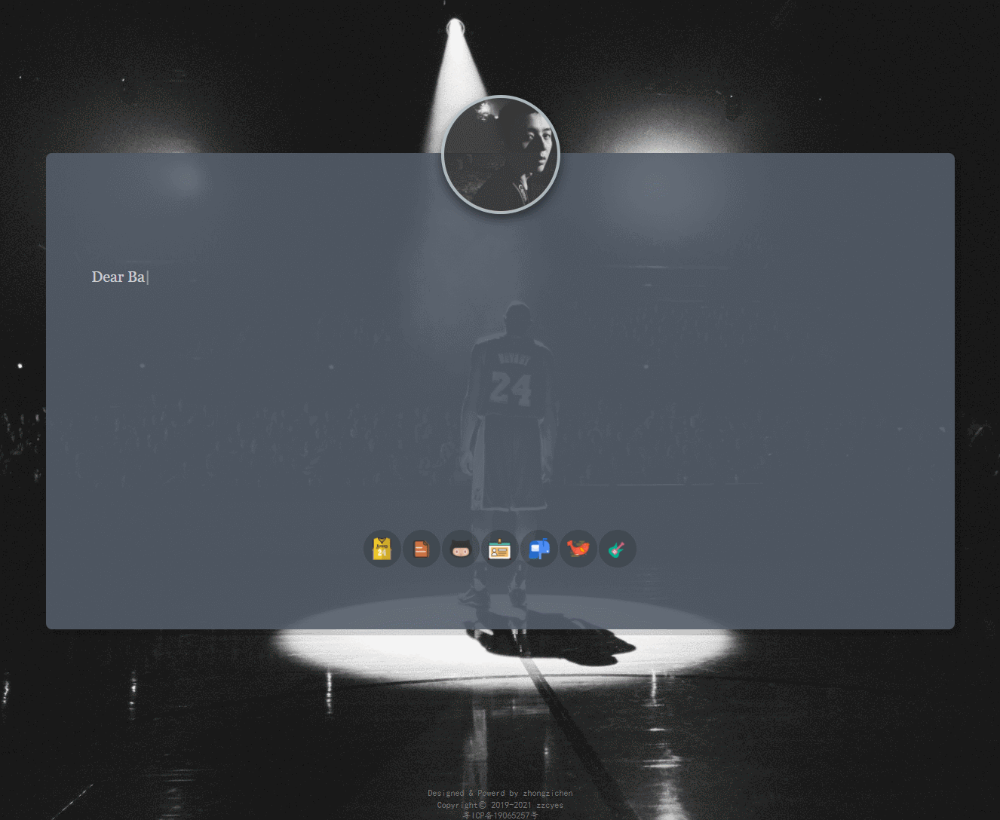
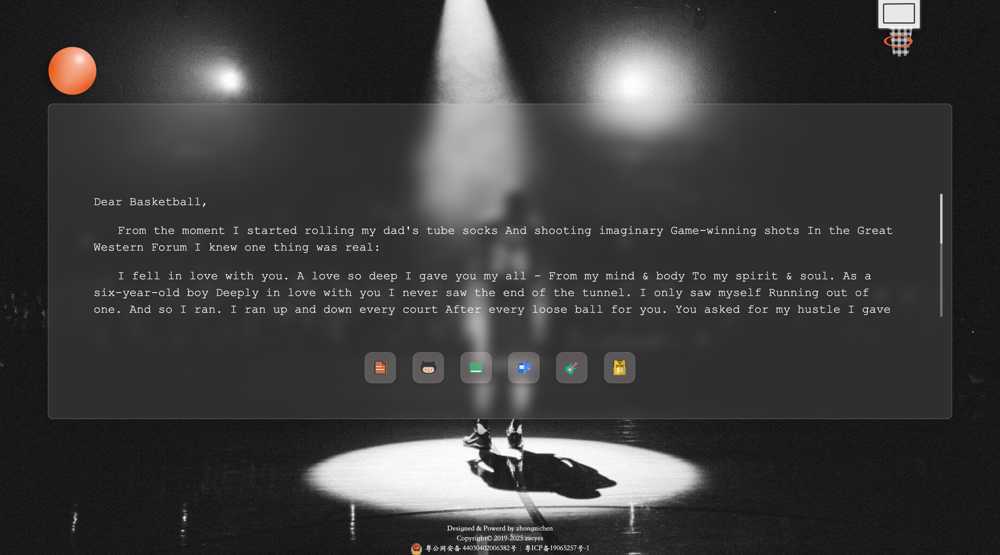

# 钟子晨的个人博客

中文 | [English](./readme.md)

这是一个使用 Rspack 构建的个人博客网站。

个人主页[👉 直达请戳这里](https://www.zzcyes.com)

<!--  -->


## 功能特点

- 多页面应用
- 响应式设计
- 个人简历展示
- 博客文章
- 特色页面（雨天、科比纪念等）

## 技术栈

- HTML/CSS/JavaScript
- Rspack (高性能 JavaScript 打包工具)
- jQuery

## 开发

```bash
# 安装依赖
yarn install

# 启动开发服务器
yarn dev

# 构建生产版本
yarn build
```

## 目录结构

```
├── src/                # 源代码
│   ├── assets/         # 静态资源
│   ├── page/           # 页面
│       ├── index/      # 主页
│       ├── resume/     # 简历
│       ├── luck/       # 运气
│       ├── rain/       # 雨天
│       ├── kobe/       # 科比纪念
│       └── gitmoji/    # Gitmoji
├── dist/               # 构建输出
├── rspack.config.js    # Rspack 配置
└── package.json        # 项目配置
```

## 构建工具迁移

本项目已从 Webpack 迁移到 Rspack，以获得更快的构建速度和更好的开发体验。

- 使用 Webpack：`yarn dev:webpack` 和 `yarn build:webpack`
- 使用 Rspack：`yarn dev` 和 `yarn build`

## 许可证

ISC
